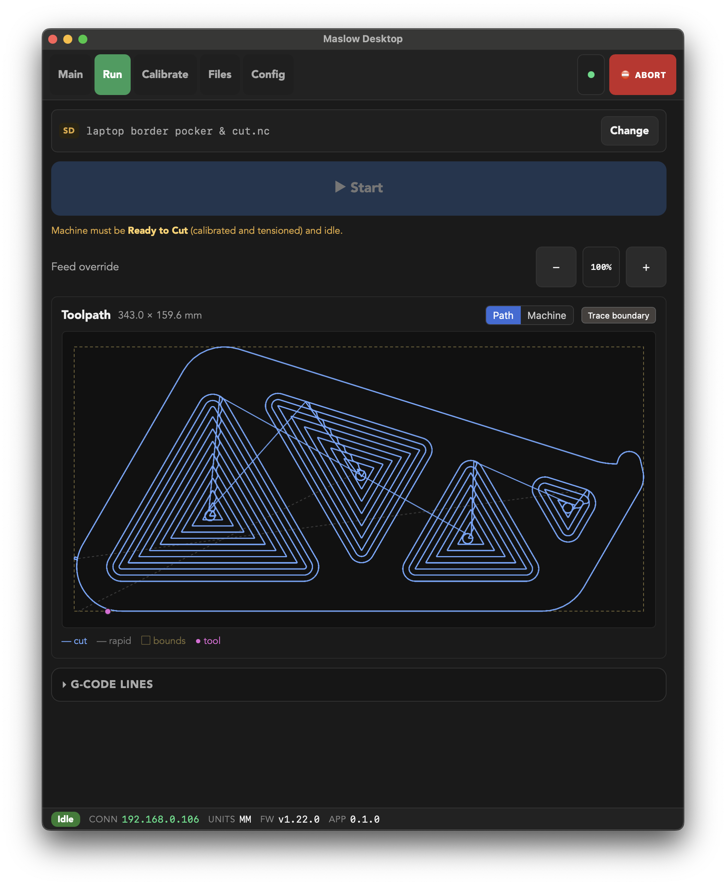
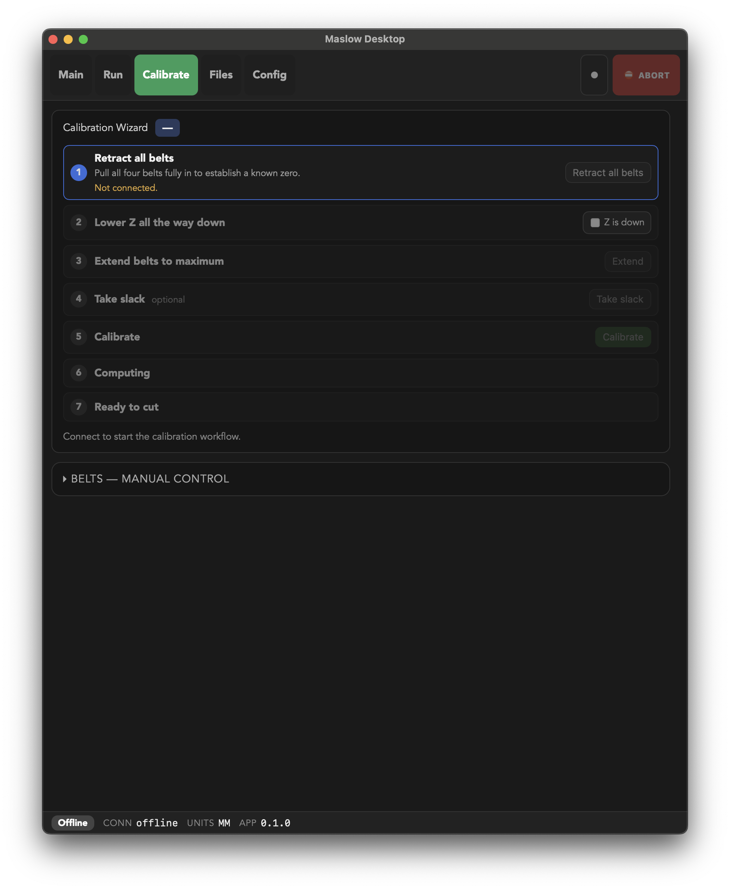
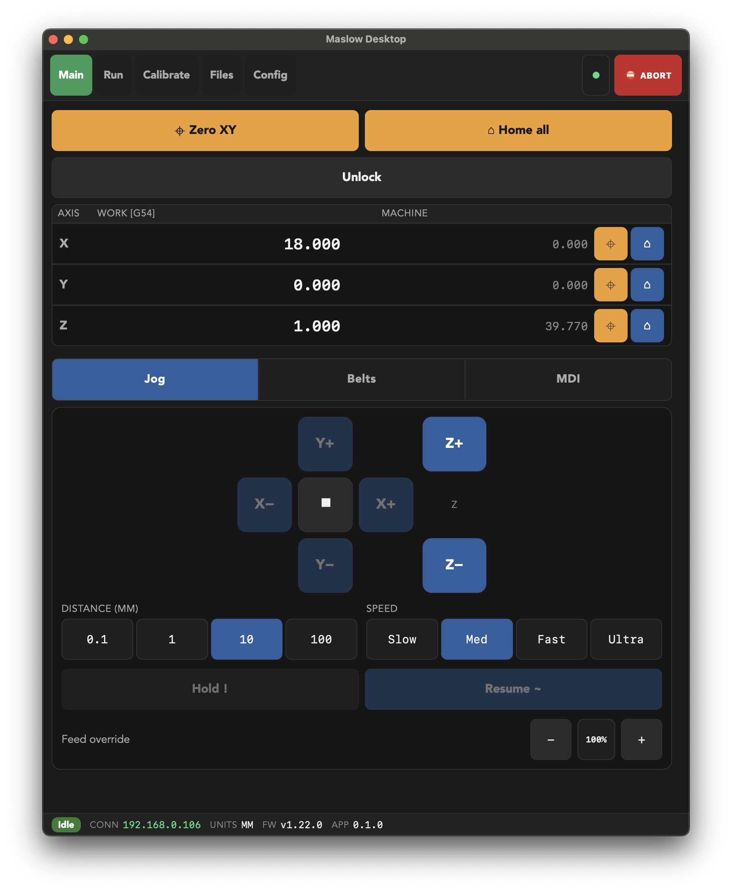

I backed the [Maslow 4](https://www.maslowcnc.com/) Kickstarter. I received it, assembled it, and then it sat in its box for eighteen months.

It happens. The kind of project you fund with enthusiasm and get back to when life finally opens a window.

When I finally powered it on, I recognized the interface immediately: it's [FluidNC](https://github.com/bdring/FluidNC), an excellent GRBL-derived controller project that fits inside an ESP32. I know that UI well: I had already put this firmware on a 3D printer board, an MKS TinyBee, to drive my [thread art machine](https://github.com/damione1/thread-art-generator). It works, it's reliable, and it isn't very sexy.

So I thought: why not make my own version.

One clarification before going further, because this kind of article is easy to read the wrong way. I like the Maslow project a lot. A large-format, open source CNC at a price that puts it within reach of a garage workshop, carried by Bar Smith and a small community that documents everything and answers questions: that's exactly the kind of project I want to see exist. The firmware and the built-in interface are the work of people doing it well, on a hard problem, with resources nowhere near those of an industrial manufacturer.

What follows isn't a critique of their work. It's the story of a guy who wrote himself a desktop client for his own machine because he wanted it to be pleasant to use, and released it since he was at it.

In practice, the built-in interface runs inside the machine's ESP32, and fitting a web UI in there on top of real-time control of four motors is impressive in itself. It does a lot with very little, but it stays minimal out of necessity: every button is there all the time, nothing tells you what order to press them in, and one click out of sequence puts the machine in alarm. Getting out of that means retracting all four belts and extending them fully again, which is slow, and every cycle carries a risk of the mechanism chewing up a belt. That isn't hypothetical, it happened to me. I didn't want to fix their interface, I wanted my own: my controller, my overlay, done my way.

## The Starting Point: A State Machine

Before drawing a single screen, I wanted to answer one question: **which transitions does the firmware actually allow?**

That information exists, but it's scattered through the firmware's C++ code, in the guards that accept or reject state changes. So I asked Claude to analyze the Maslow firmware, find the function that arbitrates state changes, and extract the exhaustive list of permitted transitions along with their conditions.

From that, I built a typed model in the Rust backend mirroring the firmware: ten explicit states, from "unknown" to "ready to cut" by way of extending the belts and computing calibration. Each state knows what it allows, and the backend derives an action policy from it that the interface consumes as-is.

The consequence is simple: **the UI only offers what the machine can actually do right now**. A button that would lead to a rejected transition is disabled, with the reason shown next to it rather than a silent dead end. You can no longer alarm the machine with a bad click sequence, because the bad sequence isn't clickable.

It's the same principle I put at the center of [Soufflé](), my other Rust project: make state explicit and forbid invalid combinations by construction. Except here, the stakes aren't a button greyed out at the wrong moment. It's a spinning router.

One detail that matters: the firmware remains the source of truth. My model is a conservative mirror of its own, not a competing authority. If it refuses something I allowed, my model is the one that's wrong.

## A Calibration Wizard in Plain Language

Once the transitions are known, the wizard almost writes itself. Every step is explained in everyday language, it advances automatically as the firmware reports progress, and the order of operations is no longer something the user has to memorize. Knowing the order is the program's job.

I added the two moves I made most often: a one-tap daily resume for when the machine is already calibrated and you just need to re-tension the belts, and a release-tension action so the belts and frame can rest overnight.

## A Desktop App, Reusing What I Already Knew

Nine days from the first commit to an installable build. That's short, and it's only possible because I wasn't starting from scratch: I reused Soufflé's stack, [Tauri](https://tauri.app/) with a Rust core and Svelte 5 for the interface. The Rust side owns the connection to the machine, G-code streaming, and the calibration model; the frontend renders.

The design constraint I set myself: **one interface, built for touch**. You use a CNC controller standing up, next to the machine, often with dirty hands. So big buttons, a red ABORT that's always reachable, a footer showing machine state at all times, and a strict color grammar (blue to act, orange for datums, green for what's running, red to stop).

I looked at what's out there in touchscreen CNC controllers to see which conventions were worth borrowing. The result is a single layout that scales from a portrait tablet mounted next to the machine up to a desktop window. No separate "mobile" and "desktop" modes to maintain, which is mostly an admitted laziness decision: two interfaces means twice the bugs.

## And an MCP Server, While I Was at It

That one came out of debugging sessions.

Driving a CNC by hand to reproduce a bug is slow. Every attempt means redoing the same sequence of gestures. At some point, mid-debug, it struck me that it would be genuinely useful if the agent helping me could operate the controller itself instead of dictating steps to me.

So the app exposes the machine's control surface over HTTP, gRPC, and [MCP](https://modelcontextprotocol.io/), behind an API key you generate yourself. It's **off by default**, which is the bare minimum when you're talking about an API that moves a cutting tool.

It isn't a feature I would have come up with on paper. It came from a practical annoyance, which is probably why it gets used.

## What It Is, and What It Isn't

Let's be clear about scope: Maslow Desktop does roughly what the embedded web UI does. Jog the axes, load and run a job, browse the SD card, edit configuration, type raw commands into a console. It's a desktop client, and anyone willing to dig into the protocol could write one.

What it adds comes down to two things: it knows the state machine and refuses to let you break it, and it walks you through calibration instead of leaving you to reconstruct the order on your own.

It's a small project, born from a personal irritation, and it solves exactly my problem: my CNC is out of its box, and I no longer lose an evening retracting and re-extending belts because I clicked in the wrong order.

## Shipping It Properly

I wrote it for myself, but publishing cost little and might help someone else with the same machine and the same annoyance.

As with Soufflé, I took the distribution chain all the way rather than stopping at "clone and compile." The macOS build is signed and notarized with Apple, so it opens without a warning and without obscure workarounds. There's a Windows installer too. Nothing to do beyond downloading and installing.

The stores are still missing. I'd like to publish a tablet version, on the App Store and on Android, because that's where this app makes the most sense: a touchscreen mounted next to the machine, not a laptop balanced on a scrap of plywood. It's mostly paperwork and signing setup, so it'll wait for a stretch where I can spend time on it without taking that time from something else. Future project, if I get to it.

---

Maslow Desktop is on [GitHub](https://github.com/damione1/maslow-desktop), under the GPL-3.0 license, with signed and notarized macOS builds and a Windows installer on the [releases](https://github.com/damione1/maslow-desktop/releases/latest) page. You'll need a Maslow running FluidNC reachable on your network.
