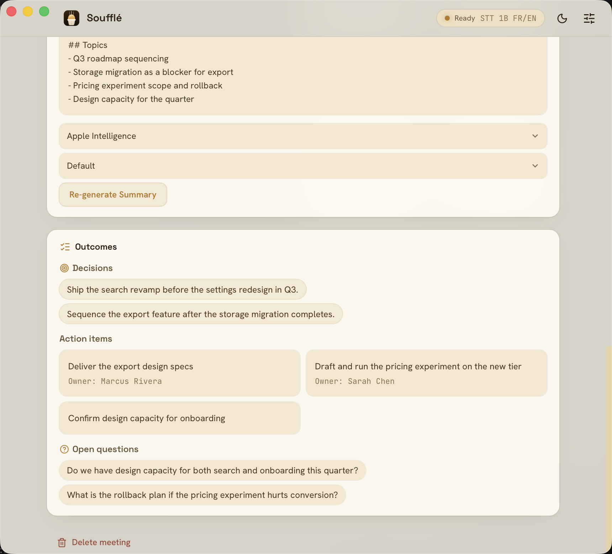

I originally just wanted an app that transcribes what I say and pastes the text wherever my cursor is. That's it. Not a product, not an open source project, just a tool I figured I'd find in ten minutes of searching.

Five months later, I had written 30,000 lines of Rust.


## Why I Wanted to Dictate My Prompts

I work with LLMs a lot, which means I write long prompts. Very long ones. At some point I noticed something counterintuitive: when I dictate a prompt instead of typing it, I get better results.

The explanation is pretty dumb. In writing, I censor myself. I look for the most concise phrasing, cut the repetitions, aim for the minimum viable message. Out loud, I do the opposite: I ramble, I restate the same idea three different ways, I go off on a tangent, come back, and mention some edge case that just occurred to me. The result is verbose and badly structured.

Which is exactly what you want. That redundancy is context. Three phrasings of the same idea are not the same information three times: each one lights up a different facet of what I actually mean. The model has more material to disambiguate with. That tangent about the edge case is a constraint I would never have bothered typing.

Typing 800 words of prompt is work. Saying 800 words takes two minutes and costs nothing. The only friction is getting from voice to text without breaking my flow. Hence the original idea: a keyboard shortcut, I talk, the text shows up where I was.

The real problem is fragmentation. Plenty of apps ship their own dictation, and the coverage is arbitrary. Claude Desktop has one, and it works well. Claude Code doesn't. Some editors do, my terminal doesn't, a website's search field certainly doesn't. The result is that for every application I have to know whether I can talk or have to type, and the ergonomics change each time. I didn't want the best dictation inside one particular app, I wanted **the same dictation everywhere**, on a single shortcut, independent of whatever has focus.

## Then I Changed Jobs

Back when I was doing application development, I had few meetings. Since moving to data and AI, where I own the platform end to end, I have a lot more. Technical arbitration with the product and engineering teams, scoping with business stakeholders, discussions where I'm the one who has to make the architecture call. They're rarely meetings where I can stay passive.

My memory for conversations has always been my weak spot. Actively participating in a discussion and precisely retaining what was said are two tasks that compete in my head. I always pick the first one, and I pay for the second two days later when someone tells me "we agreed that..."

To be transparent: I wanted [Granola](https://www.granola.ai/). On the meeting side it does its job very well, and I have no complaints about it there. Two things disqualified it anyway.

First, it isn't the same product as what I was originally after. Granola is built for meetings and audio note-taking, not for dictation. It doesn't paste a dictated message into whatever app holds my cursor, and that was never its goal. Using Granola for meetings and something else for dictation meant two tools, two subscriptions, and two mental models for what I saw as one need.

Second, transcription goes to the cloud. In consumer lending, with meetings where numbers get discussed that have no business living anywhere but our own machines, that wasn't a conversation I wanted to have. And honestly, even without the professional constraint, the idea of every meeting passing through a third-party server bothers me.

So: the same app, but entirely local.

The real payoff came later, and I hadn't planned for it. A meeting transcribed, summarized by an LLM, and exported as Markdown into my [Obsidian](https://obsidian.md/) vault isn't just a searchable archive. It's reusable context. When I'm building something and I ask an agent for help, I can give it my development notes **and** the summary of the meetings where the decisions behind that code were argued out. The "why" and the "how" in the same context window. The difference in answer quality is obvious, and the effect compounds: the bigger the archive gets, the richer the context I can assemble.

## Local First, Without the Dogma

There's an apparent contradiction to clear up. I work with cloud LLMs all day. Claude runs in my terminal, on my code, on my specs. I'm not on a crusade against remote services.

But voice is a different kind of input. A prompt I write, I choose. I know what goes into it, I can reread it before hitting enter, and I leave out what has no business being there. A recorded meeting is a raw, undifferentiated capture of everything said in the room for an hour. The numbers that weren't supposed to be repeated, the aside about an HR matter, the colleague thinking out loud. I don't control what enters that stream, and more to the point, the other people in the meeting didn't choose to send their voice to a third party.

It's the same distinction I draw at work between what can leave the platform and what can't. It isn't an ideological position, it's about whether I can answer honestly when someone asks me where their voice goes.

Hence one simple rule for Soufflé: **nothing leaves the machine, and no telemetry**. No account, no API key, no "anonymized usage statistics," no silent crash reporting. The app does exactly what its description says, and nothing more. It works on a plane, and it will still work in five years if I stop maintaining it, because there is no service to shut off.

It's also a healthy design constraint. When the cloud isn't an option, you can't push a hard problem onto a server. Model quality, RAM footprint, latency on an M4: each becomes a real tradeoff rather than a line on an invoice.

## What Already Existed

As with [dbt-guard](), I started by checking whether someone had already solved the problem.

In spring 2026, the landscape looked like this: plenty of wrappers around [whisper.cpp](https://github.com/ggerganov/whisper.cpp), often Python scripts or fairly raw apps, mostly dictation-focused. On the meeting side, the serious products (Granola, Otter, Fireflies) were all cloud. In between, not much: something finished, packaged, that does dictation **and** meetings, with local summarization, and that doesn't require starting a server in a terminal.

That space has filled in a lot since. But when I started, the gap was real, and it matched my exact need closely enough to be worth the effort.

## The Kyutai Bet

Second motivation, more opportunistic: everybody integrates Whisper. It's the default choice, it's very good, and there is nothing to learn from wiring it up for the thousandth time.

[Kyutai](https://kyutai.org/) is an open-science research lab based in Paris, funded by the Iliad Group, CMA CGM, and Schmidt Sciences. It's not a startup, and that shows in what they publish: open models, papers, and a technical approach that is genuinely different from the competition.

Their thing is [delayed streams modeling](https://github.com/kyutai-labs/delayed-streams-modeling). The idea: you have two streams, audio and text, and you model them jointly by offsetting one against the other. Delay the text and you get speech recognition. Delay the audio and you get speech synthesis. Same formulation, two models.

In practice, [stt-1b-en_fr](https://huggingface.co/kyutai/stt-1b-en_fr-candle) transcribes in streaming with a 500 ms delay, token by token, over arbitrarily long sequences. No chopping into 30-second windows like Whisper, no stitching chunks back together. The model eats audio continuously and emits text as it goes. It also ships a semantic VAD, which doesn't detect "there is signal" but "the person finished their sentence," which is a far more useful signal.

And it's natively bilingual French/English. I switch languages several times a day, often mid-sentence. That's the kind of detail that decides things.

I also saw almost nobody integrating it into open source projects. Doing what everyone else does teaches me less than clearing a path around a model nobody has packaged yet. The bet paid off on the learning side, and cost more than expected on the implementation side.

## Rust, Tauri, and Zero Experience

Third motivation: I wanted to learn Rust. Ten years of PHP, Go, and JavaScript, never a line of Rust, and never a desktop app either.

The stack came together quickly:

- **[Tauri v2](https://tauri.app/)** instead of Electron. No embedded Chromium, the system's native WebView, a single binary. A `.dmg` of a few dozen megabytes instead of 150.
- **[Svelte 5](https://svelte.dev/)** for the UI, with runes. It compiles to vanilla JS, so the WebView isn't carrying a framework runtime.
- **[specta](https://github.com/specta-rs/specta) + tauri-specta** to generate TypeScript types from the Rust DTOs. The contract between backend and UI is written once, in Rust.
- **[Candle](https://github.com/huggingface/candle)** for Kyutai inference, with the Metal backend to reach the Mac's GPU.

On paper that's clean. In practice, learning Rust while writing real-time audio code and ML inference is a questionable difficulty setting. The compiler spent my first few weeks explaining that no, I cannot do that. It was right every time.

## Under the Hood, Briefly

The architecture comes down to one rule: **the interface runs on the async runtime, audio and inference run on their own threads**. No heavy computation ever blocks the UI.

```
[Mic] → OS capture → mono conversion at the rate the model expects
      → bounded queue
[inference thread] → frame slicing → (optional) VAD
      → transcription engine → text filters → UI
```

Engines sit behind a common trait, so switching from Kyutai to Whisper or Parakeet doesn't touch the rest of the pipeline. The contract between the Rust backend and the UI is generated from the Rust types, so a malformed message shows up at compile time rather than at runtime.

The rest is systems plumbing: macOS permissions, Bluetooth, sleep and wake, lid-close, echo cancellation when the speakers are open. Nothing intellectually thrilling, but it is **most of the project's time**. A desktop app is roughly 30% business logic and 70% negotiation with the operating system. I didn't know that going in.

## The Design Decision I'm Happiest About

If there's one thing I take away from this project on the design side, it's the state machine.

Early on, the app was driven the way most apps are driven: with scattered booleans. `is_recording`, `model_loaded`, `recording_mode`, `active_profile`. Every new feature added its own, and every screen had to read them in the right order to infer what was going on. That works until it doesn't: switch tabs during a recording and the button resets, unload a model while a flag still claims it's ready, get stuck in a "stopping" state that exists nowhere in the code.

The underlying problem is that four booleans describe sixteen combinations, and half of them are nonsense. "Recording" and "model not loaded" should never be true at the same time, but nothing in the code forbids it.

So I replaced all of it with **a single type, in the backend, that describes the app's complete state**. About ten explicit states: idle, downloading the model, loading, ready, dictating, in a meeting, stopping, unloading, error. Each state carries exactly the data that makes sense for it and nothing else: a recording state necessarily carries its session id, a meeting state necessarily carries its meeting id. You cannot be in a meeting without a meeting.

And state changes go through a single function that rejects illegal transitions instead of silently performing them.

Three benefits, in the order I noticed them.

**The UI stops guessing.** It doesn't compute what to show from three flags, it receives a state and renders it. The app's four surfaces (the window, the menu bar icon, the floating indicator during recording, the global shortcut) all read the same source. They can no longer drift apart, because there is nothing left to keep in sync.

**Features get cheaper.** When I added automatic model unloading after a period of inactivity, the state portion amounted to two transitions that already existed. The entire interface reacted correctly without a single extra line: buttons greyed out, the icon changed, the indicator updated. I had first considered a dedicated event for that feature, which would have meant duplicating the same logic in four places.

**It exposes the holes.** This one I hadn't anticipated. By making the "model downloaded but not loaded" state genuinely reachable, I discovered that a button to reload the model had never been wired up at all. Nobody had noticed, because until then that state never lasted more than a few milliseconds. The state machine didn't create that bug, it made it visible.

This is the principle I carry elsewhere most easily, and there's nothing desktop-specific about it. It's the same instinct as a governed pipeline versus scattered SQL scripts: make state explicit and forbid invalid combinations by construction, rather than hoping everyone reads the flags in the right order.

## Shipping Something Someone Can Actually Install

This is the part I hadn't anticipated, and in hindsight one of the most instructive.

I've published a fair amount of open source, but always as a repository you clone and compile yourself, or a package on a registry. A desktop executable, signed, notarized, that a stranger downloads and double-clicks without the OS insulting them, I had never done.

The path: open an Apple Developer account (99 dollars a year, identity verification, a certificate to generate), sign every binary in the bundle, then send the archive to Apple, which scans it and returns a ticket you staple to the `.dmg`. Two distinct steps, and the second can fail even when the first succeeded. Without all of that, Gatekeeper simply refuses to open the app, and telling a user to right-click and pick "Open" to bypass the warning is not shipping a product.

Then a workflow that builds, signs, notarizes, and publishes the `.dmg` on every tag, plus a Homebrew tap so installation is one line. That's the step that turns "a GitHub repo" into "software you install."

None of these steps is intellectually hard. End to end, they account for a meaningful chunk of the project's time, and they are precisely the boundary between a personal project and something another person can use. I now understand much better why so many good open source tools stop at `git clone && make`.

## The Feature I Ended Up Deleting

This is the one I'm least proud of and learned the most from.

Soufflé separates speakers, but in the dumbest way possible. During a meeting it captures two distinct streams: the microphone and system audio. That gives you "Me" and "Them," and it works perfectly, because it isn't a prediction. It's a physical property of the setup: the system tap never contains my voice.

Except that as I kept iterating on meeting quality, I wanted to go further. "Them" is five people, and a summary that correctly attributes who said what is worth considerably more than an anonymous wall of text. So: real diarization, with persistent speaker recognition across meetings. Voice embeddings, clustering, cross-meeting matching, a UI to merge two profiles created by mistake, retagging that feeds the matcher, cross-lane echo detection. Several weeks of work, over 700 tests, a serious PR, a release.

And it didn't work well enough.

Not "it crashed," not "it was slow." It was **unpredictable**. One meeting created twelve speakers for three people. Another merged two distinct voices. The threshold that gave good results on my recordings gave nonsense on a colleague's.

That's when two things became clear.

The first is a machine limit. Diarization that holds up needs appreciably more compute than transcription itself, and it has to run **on top of** the STT model, on the same Mac, while the meeting is happening. I'm not saying it's impossible locally, people do it. I'm saying that on a laptop, in real time, alongside everything else, you're at the edge of what fits.

The second is a limit of my own skills, and it's the more honest of the two. Diarization is a field in its own right: choosing and calibrating the embedding model, the clustering algorithm, the thresholds, handling overlapping speech, evaluating with purpose-built metrics. It isn't something you hack together properly on the side of another project. I spent weeks stacking heuristics to compensate for expertise I don't have, and the results showed it.

A few days ago, I deleted all of it. Residual labels load as unlabeled, mic versus system-audio tagging stays. Keep it simple: dictation with paste, meeting transcription, summary.

The lesson is uncomfortable but clear. The feature that works is the one resting on a **structural invariant**: the system tap never contains my voice, so Me/Them separation is true by construction, for free, with no model to calibrate. The feature I deleted rested on a model that has to be right, and a model that is right 80% of the time produces a feature nobody can trust. In data as in product, 80% accuracy on information you can't verify isn't 80% of the value. It's often zero, because the cost of verification cancels the gain.

Deleting several weeks of code that compiles, is tested, and is in production is unpleasant. It's also the right call, and I think I made it too late.

## What It Looks Like Day to Day


The original need is covered: global shortcut, I talk, the text is pasted into the active app. For applications that reject synthetic paste (terminals, secure fields), there's a simulated-keystroke fallback. An optional LLM pass cleans up the dictated text before pasting, with editable prompt templates.



For meetings: detection of the macOS Calendar event via EventKit, a prompt to start, live transcription with Me/Them separation, meeting-end detection with automatic stop, and a summary generated locally by [Ollama](https://ollama.com/) or Apple Intelligence, with structured extraction of decisions, action items and their owners, and open questions.

And the part I use most, which I hadn't thought of at the start: a built-in **[MCP](https://modelcontextprotocol.io/) server**. The `souffle-mcp` sidecar exposes my transcripts to any MCP client (Claude Desktop, Claude Code, anything else), read-only, fully local, even when the app is closed.

That's what turns the archive into automation. I can ask "what did we decide about versioning the decision models?" while I'm coding that exact thing, and the answer comes from the actual meeting rather than my memory. More importantly, I can point an agent at the day's meetings, have it pull out the decisions and action items, and write them straight into the right place in my Obsidian vault, linked to the existing project notes. I don't copy anything by hand anymore: I describe the filing I want once, and the agent does it.

It's also why Markdown export and the MCP server both exist. Export is for owning your data, MCP is for moving it around.

Four models are available, downloaded on first use: both Kyutai models (1B bilingual, 2.6B English), Whisper Large V3 Turbo, and [Parakeet](https://huggingface.co/istupakov/parakeet-tdt-0.6b-v3-onnx) in int8 for 25 languages on CPU.

## What I Take Away

**The Rust compiler is an excellent teacher, provided you accept being wrong.** Every time I fought it, it was because my design was bad. It surfaces real system constraints at compile time that other languages let explode in production.

**Make state explicit.** The state machine, again. It's the most transferable principle from the project.

**Picking the technology nobody uses has a price.** No Stack Overflow answers, no tutorials; the only reference is the model authors' example code. I'd do it again, but knowing the entry fee is there.

**Publishing is not shipping.** Putting code on GitHub, I've been able to do for a long time. Producing a signed, notarized binary that installs in one command for someone who will never compile anything is a distinct skill, and nobody teaches it. It's worth doing at least once, because it changes how you judge whether a project is finished.

**Knowing when to delete.** See above. It's the skill this project exercised the most.

---

Soufflé is on [GitHub](https://github.com/damione1/souffle), under the GPL-3.0 license. It runs on Apple Silicon Macs, macOS 13 or newer:

```bash
brew install --cask damione1/tap/souffle
```

Nothing leaves the machine. No account, no API key, and it works offline.
