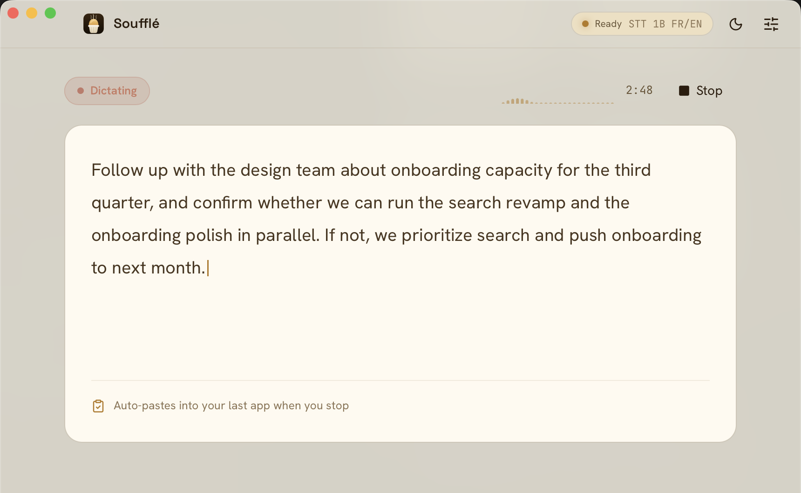

Au départ, je cherchais juste une app qui transcrit ce que je dis et colle le texte là où mon curseur se trouve. C'est tout. Pas un produit, pas un projet open source, juste un outil que je pensais trouver en dix minutes de recherche.

Cinq mois plus tard, j'ai écrit 30 000 lignes de Rust.


## Pourquoi je voulais dicter mes prompts

Je travaille énormément avec des LLM, et j'écris donc des prompts longs. Très longs. À un moment, j'ai remarqué un truc contre-intuitif : quand je dicte un prompt au lieu de le taper, j'obtiens de meilleurs résultats.

L'explication est assez bête. À l'écrit, je m'auto-censure. Je cherche la formulation la plus concise, je supprime les répétitions, je vise le message minimal viable. À l'oral, je fais l'inverse : je radote, je reformule la même idée de trois manières différentes, je pars sur une tangente, je reviens, je précise un cas limite qui me passe par la tête. Le résultat est verbeux et mal structuré.

Et c'est exactement ce qu'il faut. Cette redondance, c'est du contexte. Les trois formulations de la même idée ne sont pas trois fois la même information : chacune éclaire une facette différente de ce que je veux vraiment. Le modèle a plus de matière pour désambiguïser. La tangente sur le cas limite, c'est une contrainte que je n'aurais jamais pris la peine de taper.

Taper 800 mots de prompt, c'est un effort. En dire 800, c'est deux minutes et ça ne coûte rien. Le seul frottement, c'est de passer de la voix au texte sans casser mon flux. D'où l'idée de départ : un raccourci clavier, je parle, le texte apparaît là où j'étais.

Le vrai problème, c'est la fragmentation. Beaucoup d'applications embarquent leur propre dictée, et la couverture est aléatoire. Claude Desktop a la sienne, elle marche très bien. Claude Code, non. Certains éditeurs oui, mon terminal non, le champ de recherche d'un site web encore moins. Résultat : je dois savoir, pour chaque application, si je peux parler ou s'il faut taper, et l'ergonomie change à chaque fois. Je ne voulais pas la meilleure dictée d'une app en particulier, je voulais **la même dictée partout**, sur un seul raccourci, indépendante de ce qui a le focus.

## Et puis j'ai changé de poste

Quand je faisais du développement applicatif, j'avais peu de réunions. Depuis que je suis passé sur la data et l'IA, où je porte la plateforme de bout en bout, j'en ai beaucoup plus. Arbitrages techniques avec les équipes produit et développement, cadrage avec le métier, discussions où je suis celui qui doit trancher sur l'architecture. Ce sont rarement des réunions où je peux rester passif.

Or, ma mémoire des conversations a toujours été ma faiblesse. Participer activement à une discussion et retenir précisément ce qui s'est dit, ce sont deux tâches qui se font concurrence dans ma tête. Je choisis toujours la première, et je paye la seconde deux jours plus tard quand quelqu'un me dit « on avait convenu que... ».

Pour être transparent : je voulais [Granola](https://www.granola.ai/). Sur la partie réunion, il fait très bien son travail, et je n'ai rien à lui reprocher sur ce terrain. Deux choses le disqualifiaient quand même.

D'abord, ce n'est pas du tout le même produit que ce que je cherchais au départ. Granola est conçu pour la réunion et la prise de notes audio, pas pour la dictée. Il ne colle pas un message dicté dans l'application où j'ai le curseur, et ce n'est pas son objectif. Prendre Granola pour les réunions et autre chose pour la dictée, ça faisait deux outils, deux abonnements et deux modèles mentaux pour un besoin que je voyais comme un seul.

Ensuite, la transcription part dans le cloud. Dans le prêt à la consommation, avec des réunions où circulent des chiffres qui n'ont rien à faire ailleurs que sur nos machines, ce n'est pas une conversation que j'avais envie d'avoir. Et honnêtement, même sans contrainte professionnelle, l'idée que chaque réunion transite par un serveur tiers me dérange.

Donc : la même app, mais tout en local.

Le vrai gain, je ne l'ai découvert qu'après. Une réunion transcrite puis résumée par un LLM, exportée en Markdown dans mon [Obsidian](https://obsidian.md/), ce n'est pas juste une archive consultable. C'est du contexte réutilisable. Quand je développe un projet et que je demande à un agent de m'aider, je peux lui donner mes notes de développement **et** le résumé des réunions où on a arbitré les décisions qui ont mené à ce code. Le « pourquoi » et le « comment » dans le même contexte. La différence de qualité des réponses est nette, et c'est un effet qui compose : plus l'archive grossit, plus le contexte que je peux assembler est riche.

## Local first, sans dogmatisme

Il y a une contradiction apparente à lever. Je travaille toute la journée avec des LLM dans le cloud. Claude tourne dans mon terminal, sur mon code, sur mes specs. Je ne suis pas en croisade contre les services distants.

Mais la voix, c'est une autre nature d'entrée. Un prompt que j'écris, je le choisis. Je sais ce que j'y mets, je peux le relire avant d'appuyer sur entrée, et j'exclus ce qui n'a rien à y faire. Une réunion enregistrée, c'est une capture brute et indifférenciée de tout ce qui a été dit dans la pièce pendant une heure. Les chiffres qu'on ne devait pas répéter, la parenthèse sur un dossier RH, le collègue qui pense à voix haute. Je ne contrôle pas ce qui entre dans ce flux, et surtout, les autres personnes dans la réunion n'ont pas choisi d'envoyer leur voix chez un tiers.

C'est la même distinction que je fais au travail entre ce qui peut sortir de la plateforme et ce qui ne sort pas. Ce n'est pas une position idéologique, c'est une question de savoir si je peux répondre honnêtement quand quelqu'un me demande où va sa voix.

D'où une règle simple pour Soufflé : **rien ne quitte la machine, et aucune télémétrie**. Pas de compte, pas de clé d'API, pas de « statistiques d'usage anonymisées », pas de crash reporting silencieux. L'app fait exactement ce que sa description annonce, et rien de plus. Elle fonctionne en avion, et elle fonctionnera encore dans cinq ans si je cesse de la maintenir, parce qu'il n'y a aucun service à débrancher.

C'est aussi une contrainte de conception saine. Quand le cloud n'est pas une option, on ne peut pas repousser un problème difficile vers un serveur. La qualité du modèle, la taille de la RAM, la latence sur un M4, tout devient un vrai arbitrage plutôt qu'une ligne de facture.

## Ce qui existait déjà

Comme pour [dbt-guard](), j'ai commencé par chercher si quelqu'un avait déjà résolu le problème.

Au printemps 2026, le paysage était le suivant : beaucoup de wrappers autour de [whisper.cpp](https://github.com/ggerganov/whisper.cpp), souvent des scripts Python ou des apps un peu brutes, plutôt orientées dictée. Côté réunions, les produits sérieux (Granola, Otter, Fireflies) étaient tous cloud. Entre les deux, pas grand-chose : quelque chose de fini, de packagé, qui fait dictée **et** réunion, avec un résumé local, et qui ne demande pas de lancer un serveur dans un terminal.

Ce qui existait a d'ailleurs beaucoup grossi depuis. Mais quand j'ai commencé, le trou était réel, et il ressemblait suffisamment à mon besoin exact pour valoir l'effort.

## Le pari Kyutai

Deuxième motivation, plus opportuniste : tout le monde intègre Whisper. C'est le choix par défaut, il est très bon, et il n'y a rien à apprendre en le branchant pour la millième fois.

[Kyutai](https://kyutai.org/) est un laboratoire de recherche en science ouverte basé à Paris, financé par le groupe Iliad, CMA CGM et Schmidt Sciences. Ce n'est pas une startup, et ça se voit dans ce qu'ils publient : des modèles ouverts, des papiers, et une approche technique franchement différente de la concurrence.

Leur truc, c'est le [delayed streams modeling](https://github.com/kyutai-labs/delayed-streams-modeling). L'idée : tu as deux flux, l'audio et le texte, et tu les modélises conjointement en décalant l'un par rapport à l'autre. Si tu retardes le texte, tu obtiens de la reconnaissance vocale. Si tu retardes l'audio, tu obtiens de la synthèse. Même formulation, deux modèles.

Concrètement, [stt-1b-en_fr](https://huggingface.co/kyutai/stt-1b-en_fr-candle) transcrit en streaming avec 500 ms de délai, token par token, sur des séquences arbitrairement longues. Pas de découpage en fenêtres de 30 secondes comme Whisper, pas de recollage de morceaux. Le modèle avale l'audio en continu et crache le texte au fil de l'eau. Il embarque aussi un VAD sémantique, qui ne détecte pas « il y a du signal » mais « la personne a fini sa phrase », ce qui est une information nettement plus utile.

Et il est bilingue français/anglais nativement. Je passe d'une langue à l'autre plusieurs fois par jour, souvent dans la même phrase. C'est le genre de détail qui décide.

À l'usage, je ne voyais quasiment personne l'intégrer dans des projets open source. Faire pareil que tout le monde m'apprend moins que défricher un modèle que personne n'a encore packagé. Le pari s'est avéré payant sur le plan de l'apprentissage, et plus coûteux que prévu sur le plan de l'implémentation.

## Rust, Tauri, et zéro expérience

Troisième motivation : je voulais apprendre Rust. Dix ans de PHP, de Go et de JavaScript, jamais une ligne de Rust, jamais une app desktop non plus.

Le choix de la stack s'est fait vite :

- **[Tauri v2](https://tauri.app/)** plutôt qu'Electron. Pas de Chromium embarqué, le WebView natif du système, un seul binaire. Un `.dmg` de quelques dizaines de mégaoctets au lieu de 150.
- **[Svelte 5](https://svelte.dev/)** pour l'UI, avec les runes. Il compile en JS vanilla, donc le WebView ne porte pas de runtime de framework.
- **[specta](https://github.com/specta-rs/specta) + tauri-specta** pour générer les types TypeScript à partir des DTOs Rust. Le contrat entre le backend et l'UI est écrit une seule fois, en Rust.
- **[Candle](https://github.com/huggingface/candle)** pour l'inférence Kyutai, avec le backend Metal pour taper dans le GPU du Mac.

Sur le papier c'est propre. Dans les faits, apprendre Rust en écrivant du code audio temps réel et de l'inférence ML, c'est un choix de difficulté discutable. Le compilateur m'a passé les premières semaines à m'expliquer que non, je ne peux pas faire ça. Il avait raison à chaque fois.

## Sous le capot, en quelques lignes

L'architecture tient en une règle : **l'interface tourne sur le runtime async, l'audio et l'inférence tournent sur leurs propres threads**. Aucun calcul lourd ne vient bloquer l'UI.

```
[Micro] → capture OS → conversion mono au taux attendu par le modèle
        → file bornée
[thread inférence] → découpage en trames → (optionnel) VAD
        → moteur de transcription → filtres texte → UI
```

Les moteurs sont derrière un trait commun, ce qui permet de passer de Kyutai à Whisper ou Parakeet sans toucher au reste du pipeline. Le contrat entre le backend Rust et l'UI est généré depuis les types Rust, donc une erreur de forme sur un message se voit à la compilation plutôt qu'à l'exécution.

Le reste, c'est du travail de plomberie système : permissions macOS, Bluetooth, mise en veille, écran rabattu, annulation d'écho quand les haut-parleurs sont ouverts. Rien d'intellectuellement passionnant, mais c'est **la majorité du temps du projet**. Une app desktop, c'est environ 30 % de logique métier et 70 % de négociation avec le système d'exploitation. Je ne le savais pas avant de commencer.

## La décision de design dont je suis le plus content

S'il y a une seule chose que je retiens de ce projet sur le plan de la conception, c'est la machine à états.

Au début, l'application se pilotait comme la plupart des applications se pilotent : avec des booléens éparpillés. `is_recording`, `model_loaded`, `recording_mode`, `active_profile`. Chaque nouvelle fonctionnalité ajoutait le sien, et chaque écran devait les lire dans le bon ordre pour deviner ce qui se passait. Ça marche jusqu'au jour où ça ne marche plus : un onglet qu'on change pendant un enregistrement et le bouton se remet à zéro, un modèle déchargé pendant qu'un flag dit encore qu'il est prêt, un état « en train d'arrêter » qui n'existe nulle part et où l'app se retrouve pourtant coincée.

Le problème de fond, c'est que quatre booléens décrivent seize combinaisons, et que la moitié n'a aucun sens. « En train d'enregistrer » et « modèle non chargé » ne devraient jamais être vrais en même temps, mais rien dans le code ne l'interdit.

J'ai donc tout remplacé par **un seul type, côté backend, qui décrit l'état complet de l'application**. Une dizaine d'états explicites : au repos, téléchargement du modèle, chargement, prêt, en dictée, en réunion, en train d'arrêter, en train de décharger, en erreur. Chaque état transporte exactement les données qui ont un sens pour lui, et rien d'autre : un état d'enregistrement contient forcément l'identifiant de sa session, un état de réunion contient forcément l'identifiant de la réunion. On ne peut pas être en réunion sans réunion.

Et les changements d'état passent par une seule fonction, qui refuse les transitions illégales au lieu de les exécuter silencieusement.

Trois bénéfices, dans l'ordre où je les ai constatés.

**L'UI ne devine plus rien.** Elle ne calcule pas son affichage à partir de trois drapeaux, elle reçoit un état et l'affiche. Les quatre surfaces de l'app (la fenêtre, l'icône de la barre de menus, le témoin flottant pendant l'enregistrement, le raccourci global) lisent toutes la même source. Elles ne peuvent plus se désynchroniser, parce qu'il n'y a plus rien à synchroniser.

**Les fonctionnalités deviennent moins chères.** Quand j'ai ajouté le déchargement automatique du modèle après une période d'inactivité, la partie « état » a représenté deux transitions déjà existantes. Toute l'interface a réagi correctement sans une ligne de plus : les boutons se sont grisés, l'icône a changé, le témoin s'est mis à jour. J'avais d'abord envisagé un événement dédié pour cette fonctionnalité, ce qui aurait voulu dire redupliquer la même logique à quatre endroits.

**Elle révèle les trous.** Celui-là, je ne l'avais pas anticipé. En rendant l'état « modèle téléchargé mais pas chargé » réellement atteignable, j'ai découvert qu'aucun bouton pour recharger le modèle n'avait jamais été branché. Personne ne s'en était rendu compte parce que, jusque-là, cet état ne durait jamais plus de quelques millisecondes. La machine à états n'a pas créé ce bug, elle l'a rendu visible.

C'est le principe que j'emporte le plus facilement ailleurs, et il n'a rien de spécifique aux applications desktop. C'est exactement le même réflexe qu'un pipeline gouverné face à des scripts SQL éparpillés : rendre l'état explicite et interdire les combinaisons invalides par construction, plutôt que d'espérer que tout le monde lise les drapeaux dans le bon ordre.

## Livrer une app que quelqu'un peut installer

C'est la partie que je n'avais pas anticipée, et rétrospectivement l'une des plus formatrices.

J'ai publié pas mal de choses en open source, mais toujours sous la forme d'un dépôt qu'on clone et qu'on compile soi-même, ou d'un package sur un registre. Un exécutable desktop, signé, notarisé, qu'un inconnu télécharge et double-clique sans que le système ne l'insulte, je n'avais jamais fait.

Le parcours : ouvrir un compte Apple Developer (99 dollars par an, vérification d'identité, certificat à générer), signer chaque binaire du bundle, puis envoyer l'archive à Apple qui la scanne et renvoie un ticket à agrafer au `.dmg`. Deux étapes distinctes, et la seconde peut échouer même quand la première a réussi. Sans tout ça, Gatekeeper refuse simplement d'ouvrir l'app, et demander à un utilisateur de faire un clic droit puis « Ouvrir » pour contourner l'avertissement, ce n'est pas livrer un produit.

Ensuite, un workflow qui construit, signe, notarise et publie le `.dmg` à chaque tag, et un tap Homebrew pour que l'installation tienne en une ligne. C'est le geste qui transforme « un dépôt GitHub » en « un logiciel qu'on installe ».

Aucune de ces étapes n'est intellectuellement difficile. Mises bout à bout, elles représentent une part significative du temps du projet, et elles constituent exactement la frontière entre un projet perso et un truc que quelqu'un d'autre peut utiliser. Je comprends beaucoup mieux, maintenant, pourquoi tant de bons outils open source restent au stade du `git clone && make`.

## La feature que j'ai fini par supprimer

Voilà celle dont je suis le moins fier et dont j'ai le plus appris.

Soufflé sépare les locuteurs, mais de la manière la plus bête possible. Pendant une réunion, il capture deux flux distincts : le micro et l'audio système. Ça donne « Moi » et « Eux », et ça marche parfaitement, parce que ce n'est pas une prédiction. C'est une propriété physique du montage : le tap système ne contient jamais ma voix.

Sauf qu'à force d'itérer sur la qualité des réunions, j'ai voulu aller plus loin. « Eux », ce sont cinq personnes, et un résumé qui attribue correctement les propos vaut nettement mieux qu'un mur de texte anonyme. Donc : de la vraie diarisation, avec reconnaissance persistante des locuteurs d'une réunion à l'autre. Empreintes vocales, clustering, matching inter-réunions, UI pour fusionner deux profils créés par erreur, réétiquetage qui nourrit le matching, détection d'écho inter-flux. Plusieurs semaines de travail, plus de 700 tests, une PR sérieuse, une release.

Et ça ne marchait pas assez bien.

Pas « ça crashait », pas « c'était lent ». C'était **imprévisible**. Une réunion créait douze locuteurs pour trois personnes. Une autre fusionnait deux voix distinctes. Le seuil qui donnait de bons résultats sur mes enregistrements donnait n'importe quoi sur ceux d'un collègue.

C'est là que j'ai compris deux choses.

La première est une limite de la machine. Une diarisation qui tient la route demande sensiblement plus de calcul que la transcription elle-même, et il faut la faire tourner **en plus** du modèle STT, sur le même Mac, pendant que la réunion se déroule. Je ne dis pas que c'est impossible en local, des gens le font. Je dis que sur un laptop, en temps réel, en même temps que le reste, on est à la frontière de ce qui rentre.

La seconde est une limite de mes compétences, et c'est la plus honnête des deux. La diarisation est un domaine à part entière : choix et calibration du modèle d'embedding, algorithme de clustering, seuils, gestion du chevauchement de parole, évaluation avec des métriques dédiées. Ce n'est pas quelque chose qu'on bricole correctement en marge d'un projet. J'ai passé des semaines à empiler des heuristiques pour compenser une expertise que je n'ai pas, et le résultat le montrait.

Il y a quelques jours, j'ai tout supprimé. Les labels résiduels se chargent comme « non étiqueté », le tagging micro contre audio système reste. On garde les choses simples : dictée avec collage, transcription de réunion, résumé.

La leçon est inconfortable mais claire. La feature qui marche est celle qui repose sur un **invariant structurel** : le tap système ne contient jamais ma voix, donc la séparation Moi/Eux est vraie par construction, gratuitement, sans modèle à calibrer. La feature que j'ai supprimée reposait sur un modèle qui doit avoir raison, et un modèle qui a raison 80 % du temps produit une fonctionnalité dans laquelle personne ne peut avoir confiance. En data comme en produit, 80 % de justesse sur une information qu'on ne peut pas vérifier, ce n'est pas 80 % de valeur. C'est souvent zéro, parce que le coût de vérification annule le gain.

Supprimer plusieurs semaines de code qui compile, qui est testé et qui est en production, c'est désagréable. C'est aussi la bonne décision, et je pense que je l'ai prise trop tard.

## Ce que ça donne au quotidien



Le besoin initial est couvert : raccourci global, je parle, le texte est collé dans l'app active. Pour les applications qui refusent le collage synthétique (terminaux, champs sécurisés), il y a un repli en frappe simulée. Une passe LLM optionnelle nettoie le texte dicté avant de le coller, avec des templates de prompt éditables.


Pour les réunions : détection de l'événement dans le calendrier macOS via EventKit, proposition de démarrer, transcription en direct avec séparation Moi/Eux, détection de fin de réunion avec arrêt automatique, résumé généré en local par [Ollama](https://ollama.com/) ou Apple Intelligence, avec extraction structurée des décisions, des actions et de leurs porteurs, et des questions ouvertes.

Et la partie que j'utilise le plus, celle à laquelle je n'avais pas pensé au départ : un **serveur [MCP](https://modelcontextprotocol.io/)** embarqué. Le sidecar `souffle-mcp` expose mes transcriptions à n'importe quel client MCP (Claude Desktop, Claude Code, autre), en lecture seule, en local, même quand l'app est fermée.

C'est ce qui transforme l'archive en automatisation. Je peux demander « qu'est-ce qu'on avait décidé sur le versioning des modèles de décision ? » pendant que je code la chose en question, et la réponse sort de la vraie réunion, pas de ma mémoire. Mais surtout, je peux lancer un agent qui va chercher les réunions de la journée, en tire les décisions et les actions, et les écrit directement au bon endroit dans mon vault Obsidian, avec les bons liens vers les notes de projet existantes. Je ne recopie plus rien à la main : je décris le rangement que je veux une fois, et l'agent le fait.

C'est aussi la raison pour laquelle l'export en Markdown et le serveur MCP coexistent. L'export sert à posséder ses données, le MCP sert à les faire circuler.

Quatre modèles sont disponibles, téléchargés à la première utilisation : les deux Kyutai (1B bilingue, 2,6B anglais), Whisper Large V3 Turbo, et [Parakeet](https://huggingface.co/istupakov/parakeet-tdt-0.6b-v3-onnx) en int8 pour 25 langues sur CPU.

## Ce que j'en retiens

**Le compilateur Rust est un excellent professeur, à condition d'accepter d'avoir tort.** À chaque fois que je me suis battu contre lui, c'est parce que mon design était mauvais. Il rend visibles à la compilation des contraintes réelles du système que d'autres langages laissent exploser en production.

**Rendre l'état explicite.** La machine à états, encore. C'est le principe le plus transférable du projet.

**Choisir la technologie que personne n'utilise a un prix.** Aucune réponse Stack Overflow, aucun tutoriel, la seule référence c'est le code d'exemple des auteurs du modèle. Je le referais, mais en sachant que le ticket d'entrée est là.

**Publier n'est pas livrer.** Mettre du code sur GitHub, je sais faire depuis longtemps. Produire un binaire signé, notarisé, installable en une commande par quelqu'un qui ne compilera jamais rien, c'est une compétence distincte, et personne ne l'enseigne. Elle vaut le détour au moins une fois, parce qu'elle change la façon dont on juge la finition d'un projet.

**Savoir supprimer.** Voir plus haut. C'est la compétence que ce projet m'a le plus fait travailler.

---

Soufflé est sur [usesouffle.app](https://usesouffle.app/fr/), et le code source sur [GitHub](https://github.com/damione1/souffle) sous licence GPL-3.0. Il tourne sur Mac Apple Silicon, macOS 13 minimum :

```bash
brew install --cask damione1/tap/souffle
```

Rien ne quitte la machine. Pas de compte, pas de clé d'API, et ça fonctionne hors ligne.
